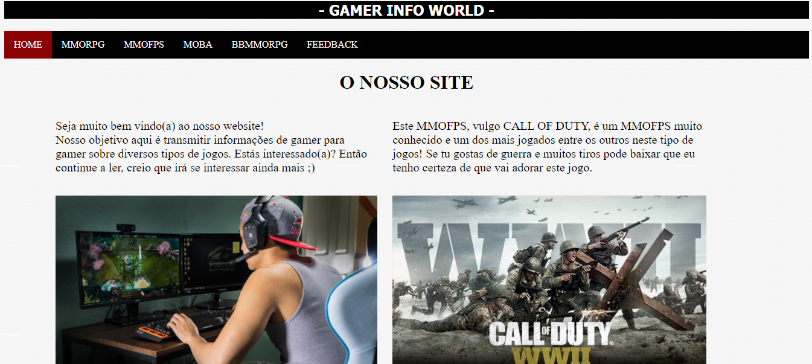

<h1 align="center"> 
  GAMES INFO WEBSITE 
</h1>

 This website was built back in 2018 high school when I was in the IT course in Lisbon. 

  

## 📑 ABOUT THE WEBSITE
This simple project was my first website ever. Well, we can notice it by looking at this awful layout tho 😅 but, although I find it ugly nowadays, back in the time I was so proud of myself for being able to do such a thing! This was when I fell in love with Web Development. 

The website was built with 6 pages. Home, MMORPG, MMOFPS, MOBA, BBMMORPG and Feedback page.  
- The home page has a large explanation about the topic of the website which is games.  
- The MMORPG, MMOFPS, MOBA and BBMMORPG pages has brief informations about this type of games and some examples following by the original links of the games mentioned.  
- The Feedback page has a formulary (not exactly working) and honestly I don't even know why I had the idea of introducing a feedback page on this website but, is not a bad idea tho.

## 👩‍💻 USED TECHNOLOGIES
On this website I worked with:  
- HTML5.
- CSS3.

## 📌 POSSIBLE UPGRADES
I'm uploading this project on github because I think this is something I can work on to improve and practice my habilities so, possibly in my free times I'll be doing some updates on this website without changing it's original objective.

## 💁‍♀️ AUTHOR
<table>
  <tr>
    <td align="center">
      <a href="https://github.com/laragraysse">
         
        
          <b>Lara Graysse</b>
        
      </a>
    </td>
  </tr>
</table>
